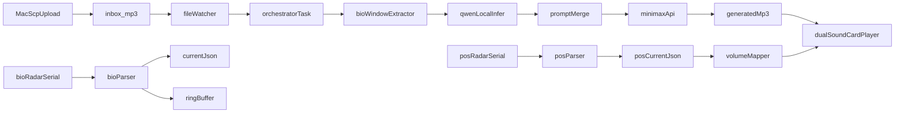

# 树莓派5 毫米波联动实时音乐系统 PRD

## 1. 目标与范围

- 目标：用户上传 MP3 后，系统抓取“上传时刻附近的呼吸心率实时数据”，用本地 Qwen 生成提示词，叠加固定提示词后请求 MiniMax 生成新 MP3，再根据实时坐标控制两个声卡音量（靠近哪个，哪个更大）。
- 强实时优先：优先低延迟和稳定链路，允许音质策略适度妥协。
- 运行核心在树莓派5；Mac 负责上传 MP3（SCP）。

## 2. 功能需求（按链路）

- **输入 A（音频）**：Mac 用 `scp` 上传到文件夹1；系统检测新增 MP。
- **输入 B（生理）**：呼吸心率雷达串口/USB 接入树莓派；写入文件夹2，仅保留最新状态与短窗口缓冲。
- **输入 C（位置）**：位置雷达接入树莓派；写入文件夹3，仅保留实时坐标。
- **分析与生成**：
  - 新 MP3 到达时，抓取该时刻前后 N 秒呼吸心率数据。
  - 本地 Qwen 生成“动态提示词”。
  - 动态提示词 + 固定提示词 -> MiniMax API 生成目标 MP3。
- **播放控制**：读取实时坐标，映射为双声卡音量（left/right or cardA/cardB），平滑更新。

## 3. 非功能要求

- 端到端目标延迟（上传触发到开始播放）：`<= 3~8s`（受 MiniMax 响应影响）。
- 坐标到音量控制更新周期：`50~100ms`。
- 进程崩溃可自恢复（systemd）。
- 日志可追踪单次任务（task_id 串联上传、分析、生成、播放）。

## 4. 建议目录与数据契约

- 建议项目根目录：`/opt/rpi_realtime_music`
- 关键目录：
  - `/opt/rpi_realtime_music/inbox_mp3`（文件夹1，上传入口）
  - `/opt/rpi_realtime_music/realtime_bio`（文件夹2）
  - `/opt/rpi_realtime_music/realtime_pos`（文件夹3）
  - `/opt/rpi_realtime_music/generated_mp3`
  - `/opt/rpi_realtime_music/logs`
- 数据文件：
  - `realtime_bio/current.json`：仅当前值（hr, rr, ts）
  - `realtime_bio/ringbuffer.jsonl`：最近 30~120 秒窗口
  - `realtime_pos/current.json`：仅当前坐标（x,y,dist,ts）

## 5. 模块拆分（AI 编程友好）

- `watcher`：监听文件夹1新增 MP3（去抖动、完整写入检测）。
- `sensor_bio`：解析呼吸心率串口协议 -> current + ring buffer。
- `sensor_pos`：解析坐标串口协议 -> current。
- `prompt_engine`：
  - 读取 MP3 元信息（可选）+ 上传时段生理特征
  - 调用本地 Qwen（轻量模型）输出动态提示词
  - 与固定提示词模板拼接
- `minimax_client`：请求生成 MP3，下载落盘。
- `playback_router`：
  - 双声卡输出（ALSA/PipeWire）
  - 坐标->音量映射（含平滑滤波和上下限）
- `orchestrator`：任务编排、状态机、失败重试、日志。

## 6. 核心流程图

## 7. 分阶段实施计划（一步步搭建）

### Phase 0：硬件与系统基线

- 安装 Raspberry Pi OS（64位）并更新系统。
- 验证两个声卡可被识别（`aplay -l`）。
- 验证两个毫米波雷达串口设备名稳定（`/dev/ttyUSB*` + udev 固定别名）。
- 建立目录与 Python venv，准备 `.env`（MiniMax Key）。

### Phase 1：输入链路打通（不接 AI）

- 完成 `scp` 上传到文件夹1并触发 watcher。
- 生理传感器进程写 `current.json + ringbuffer.jsonl`。
- 位置传感器进程写 `current.json`。
- 增加健康检查接口（本地 HTTP `/health`）。

### Phase 2：本地 Qwen 提示词生成

- 部署轻量本地 Qwen 推理方案（优先 1.8B/4B 量化，保证树莓派可跑）。
- 实现 `bio_window_extractor`（按 MP3 到达时间切片）。
- 设计固定提示词模板：风格、节奏、情绪、时长、安全约束。
- 输出可审计 `prompt_final.txt`。

### Phase 3：MiniMax 生成与回传

- 实现 `minimax_client`：提交任务、轮询状态、下载 MP3。
- 加重试与超时（网络失败可恢复）。
- 成功后写入 `generated_mp3/<task_id>.mp3`。

### Phase 4：双声卡播放与坐标控音

- 播放进程支持两个设备并发播放同一生成音频流。
- 位置坐标映射为两个音量系数（例如按 x 轴距离归一化）。
- 加平滑：指数滑动平均，避免音量抖动。
- 加保护：最小音量阈值、突变限速、目标丢失回退策略。

### Phase 5：编排与守护

- 统一 `orchestrator` 状态机（WAIT_UPLOAD -> ANALYZE -> GENERATE -> PLAY）。
- 使用 `systemd` 托管各进程，开机自启。
- 增加结构化日志和任务追踪。

## 8. 测试计划（按阶段可执行）

### T1 基础联通

- 用 Mac 连续上传 3 个 MP3，确认 watcher 每次仅触发一次。
- 断网后恢复，确认不会丢任务（至少记录失败可重试）。

### T2 传感器正确性

- 静止/有人呼吸场景切换，验证 `current.json` 时间戳持续更新。
- 坐标左右移动，验证 `x` 连续变化且无长时间卡死。

### T3 AI 链路

- 固定输入样本，验证 Qwen 输出提示词稳定、可读、字段齐全。
- MiniMax 请求失败注入（401/超时），验证重试与错误日志。

### T4 实时性

- 统计上传->开始播放延迟，记录 P50/P90。
- 坐标变化到音量变化延迟应在目标范围（50~100ms 级）。

### T5 听感与控制

- 人在左/中/右位置移动，主观确认“靠近哪个哪个更大”。
- 检查音量切换是否平滑、无明显爆音。

## 9. 验收标准（DoD）

- 上传 MP3 后，系统自动完成：生理窗口提取 -> Qwen 提示词 -> MiniMax 生成 -> 双声卡播放。
- 位置变化可稳定驱动双声卡音量差。
- 关键故障（传感器断开、网络失败）有日志、有重试/降级，不导致系统整体卡死。

## 10. 风险与对策

- 本地 Qwen 性能不足：优先量化小模型、减少上下文长度、缓存模板。
- MiniMax 生成时间波动：提前播底噪/过渡音，避免“无声等待”。
- 传感器串口漂移：使用 udev 固定设备名并做启动自检。
- 多进程竞争：用单向消息总线（Redis/ZeroMQ 或本地队列）解耦。

## 11. 你可以直接执行的首周任务清单

- Day1：树莓派系统、声卡与串口设备固定命名。
- Day2：文件夹1/2/3 数据流打通（不接 AI）。
- Day3：本地 Qwen 跑通并生成动态提示词。
- Day4：MiniMax 生成音频闭环。
- Day5：坐标控音 + 双声卡联调 + 延迟测试。
- Day6：systemd 托管与异常恢复测试。
- Day7：端到端压测与参数调优。

