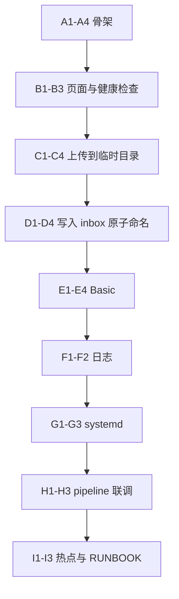

# 热点网页 MP3 上传 — 产品需求文档（PRD）

## 1. 背景与目标

- **现状**：树莓派上已有自动化流水线（上传/监听 → 生理与音频特征 → 提示词 → MiniMax → 生成 MP3 → 双声卡与位置控音），当前通过 Mac `scp` 上传。
- **目标**：在**手机热点局域网**内，用户打开浏览器即可上传 MP3，无需 `scp`；上传成功后触发与现有流程一致的自动化执行。
- **约束（已确认）**：认证采用 **HTTP Basic**；传输采用 **HTTP（内网演示）**，不强制 HTTPS。

## 2. 用户与典型场景

### 2.1 演示场景（你描述的主路径）

1. 手机开启热点：**SSID = `test`**，密码 = `test12346`（建议在 PRD 中写为可配置项，避免与真实路由器混淆）。
2. 树莓派连接该热点（或树莓派开热点、手机连 Pi——二选一，需在部署文档中固定一种）。
3. 手机浏览器访问：`http://<树莓派IP>:<端口>/`（例如 `http://192.168.43.2:8080/`）。
4. 浏览器弹出 **HTTP Basic** 登录：用户名为树莓派登录用户（如 `pi`），密码为 **`123456`**（示例；实际以你设备为准）。
5. 在网页选择本地 MP3 文件并上传。
6. 服务端将文件保存到既有目录：`/opt/rpi_realtime_music/inbox_mp3/`，文件名防冲突（时间戳或 UUID 前缀）。
7. 与现有 `run_pipeline.sh` / watcher 逻辑一致：**检测到稳定新文件**后进入生成与播放流程。

### 2.2 非目标（本版不做）

- 公网暴露、域名、Let's Encrypt（若未来需要再单列一期）。
- 多用户权限体系、审计后台（可二期）。
- 大文件断点续传（可二期）。

## 3. 功能需求

### 3.1 网页端

- **上传页**：单页或极简页，包含：
  - 文件选择（`accept="audio/mpeg,.mp3"`）
  - 上传按钮
  - 上传中状态（禁用按钮、进度条可选）
  - 成功/失败提示（HTTP 状态 + 简短文案）
- **认证**：HTTP Basic；未授权返回 `401`，授权后可见上传页。
- **限制**：
  - 仅允许 `.mp3` 扩展名（服务端二次校验 magic bytes 可选）。
  - 单文件大小上限（建议默认 50MB，可配置）。
  - 并发上传数限制（MVP 可为 1）。

### 3.2 服务端（树莓派）

- 监听固定端口（建议 `8080`，避免与系统服务冲突）。
- 将上传流写入：`/opt/rpi_realtime_music/inbox_mp3/<safe_filename>.mp3`。
- **安全文件名**：去除路径遍历字符，仅保留 `[a-zA-Z0-9._-]` 或统一重命名为 `uuid.mp3`。
- **与流水线衔接**：
  - **方案 A（推荐）**：不重复造轮子——上传完成后仅落盘；依赖现有 `run_pipeline.sh` 轮询 `inbox_mp3` 检测新稳定文件。
  - **方案 B**：上传完成后通过本地 HTTP/Unix 信号通知 pipeline（可选优化，非 MVP 必须）。
- **日志**：每次上传记录时间、客户端 IP、文件名、大小、任务 id（若 pipeline 已生成）。

### 3.3 运维与开机自启

- 提供 `systemd` 单元（如 `music-upload-web.service`），与现有 `music-pipeline.service`、`r60amp1-decode.service`、`dual-volume.service` 同机编排。
- 依赖顺序建议：`network-online.target` 之后启动 Web；pipeline 可与 Web 并行。

## 4. 非功能需求

- **可用性**：热点内任意手机浏览器可访问；页面需适配手机端。
- **性能**：单用户上传；生成耗时由 MiniMax 决定，与网页无关。
- **可靠性**：上传失败不覆盖已有文件；写临时文件再 `rename` 原子替换（与现有 `inbox` 稳定检测策略一致）。
- **安全（内网 HTTP 下的最小说明）**：
  - HTTP Basic 密码在明文 HTTP 下可被同热点嗅探，**仅适用于演示/可信环境**；文档中需明确风险提示。
  - 长期建议：改用 HTTPS 或令牌上传；本版按你选项保持 HTTP。

## 5. 系统架构（概要）

## 6. 接口与数据约定

- **上传**：`POST /upload`（或 `POST /` multipart），`Content-Type: multipart/form-data`，字段名 `file`。
- **响应**：`200` + JSON `{ "ok": true, "path": "...", "size": ... }`；失败返回 `4xx/5xx` + 错误信息。
- **目录**：与现有 PRD 一致：`/opt/rpi_realtime_music/inbox_mp3`。

## 7. 分步实施（落地清单）

### Phase 0：网络与 IP 固定

1. 固定一种拓扑：**手机热点 + Pi 连** 或 **Pi 热点 + 手机连**（二选一写进 RUNBOOK）。
2. 在 Pi 上记录热点网段内 IP（例如 `192.168.43.x`），演示时用手机访问该 IP。

### Phase 1：最小 Web 服务

1. 选用轻量框架（如 **Flask** 或 **FastAPI**）实现 `GET /` + `POST /upload`。
2. 配置 HTTP Basic：用户名 `pi`，密码从环境变量读取（如 `UPLOAD_WEB_PASSWORD`），**不要写死**。
3. 本地验证：`curl -u pi:密码 -F file=@test.mp3 http://127.0.0.1:8080/upload`。

### Phase 2：与 inbox 联动

1. 确认上传文件出现在 `inbox_mp3` 且 `run_pipeline` 能检测到新文件（稳定大小逻辑）。
2. 若 pipeline 只认“新文件”，避免重复上传同名覆盖：服务端自动加时间戳前缀。

### Phase 3：systemd 与开机自启

1. 新增 `music-upload-web.service`，`ExecStart` 指向 venv/python 或系统 python。
2. `sudo systemctl enable --now music-upload-web.service`。

### Phase 4：端到端验收

1. 手机连热点 → 打开网页 → Basic 登录 → 上传 MP3。
2. 观察 `logs/tasks` 新任务、`generated_mp3` 新文件、双声卡播放与位置控音仍正常。

## 8. 验收标准（DoD）

- 热点内手机浏览器可完成上传，无需 `scp`。
- 上传后 **30 秒内**（网络正常时）pipeline 能进入处理（以现有 pipeline 逻辑为准）。
- 失败场景有明确提示（认证失败、非 mp3、过大）。

## 9. 风险与后续

- **HTTP 明文风险**：文档标注；二期 HTTPS + 令牌。
- **热点 IP 变化**：可写 DHCP 保留或 Pi 静态 IP（若路由器/热点支持）。
- **同名文件**：必须服务端重命名或拒绝覆盖。

## 10. 与你现有文档的衔接

- 在 [RUNBOOK.md](未命名文件夹/pi music/RUNBOOK.md) 增加一节：**「网页上传」**（URL、端口、账号、密码、热点 SSID）。
- 密码与热点口令**不要提交到 Git**；用 `.env` 或 systemd `EnvironmentFile`。

## 11. MVP 分步构建计划（细粒度、每步可测）

原则：**每一步完成后立刻用「一条命令或一次浏览器操作」验证**；先本机 `127.0.0.1`，再热点网段；先无认证打通上传，再加 Basic，最后 systemd 与端到端。

---

### Block A — 工程骨架与依赖（本地 / 开发机可先做）

| ID | 任务（尽量小） | 如何测试（通过标准） |
|----|----------------|----------------------|
| A1 | 在 `app/upload_web/` 下建立包结构：`__init__.py`、`main.py`、`config.py`（可先空实现）。 | 目录存在；`python -c "import app.upload_web"` 不报错（按实际包路径调整）。 |
| A2 | 增加 `requirements.txt`：仅锁定 Web 框架（Flask 或 FastAPI + uvicorn 二选一）及运行所需最小依赖。 | `pip install -r requirements.txt` 成功。 |
| A3 | `config.py`：`PORT`（默认 8080）、`INBOX_DIR`（默认 `/opt/rpi_realtime_music/inbox_mp3`）、`MAX_UPLOAD_BYTES`、`BASIC_USER`、`UPLOAD_WEB_PASSWORD` 均从**环境变量**读取；缺省密码时启动失败并打印明确错误（避免静默不安全）。 | 未设 `UPLOAD_WEB_PASSWORD` 时进程退出且 stderr 有提示；设置后进程能启动。 |
| A4 | `main.py`：创建 app，绑定 `0.0.0.0` 与 `PORT`，仅注册占位路由。 | `curl -sS http://127.0.0.1:8080/` 返回非 5xx（或框架默认 404，说明进程存活）。 |

---

### Block B — 可观测性与上传页壳（仍可不认证）

| ID | 任务 | 如何测试 |
|----|------|----------|
| B1 | 实现 `GET /health`，返回 JSON：`{"ok": true}`（或含版本/commit 占位）。 | `curl -sS http://127.0.0.1:8080/health` 为 200 且 body 含 `"ok":true`。 |
| B2 | `templates/index.html`：表单 `method="post"`、`action="/upload"`、`enctype="multipart/form-data"`，字段名 `file`，`accept="audio/mpeg,.mp3"`，含提交按钮。 | 浏览器打开 `/` 能看到表单（此时可先不挂 Basic）。 |
| B3 | `GET /` 渲染上述模板（或 FastAPI Jinja2）。 | 浏览器访问 `/` 页面可加载；开发者工具无静态资源 404（若有 `static/`）。 |

---

### Block C — 上传接口（先不写 inbox，写到**临时目录**）

| ID | 任务 | 如何测试 |
|----|------|----------|
| C1 | `POST /upload`，字段 `file`；将内容保存到**可配置临时目录**下的唯一文件名（如 UUID），保存后返回 JSON：`ok`、`path`、`size`。 | `curl -F file=@./small.mp3 http://127.0.0.1:8080/upload` → 200，且磁盘上出现该文件，`size` 与 `wc -c` 一致。 |
| C2 | 拒绝非 `.mp3`：扩展名校验；错误时 400 + 明确 JSON/text。 | `curl -F file=@./x.txt` → 400。 |
| C3 | 超过 `MAX_UPLOAD_BYTES` 返回 413（或 400，与前端约定一致即可）。 | 构造超大文件或调低上限后上传 → 预期状态码。 |
| C4 |（可选）校验 magic bytes `ID3` 或 `ff fb`，与扩展名双保险。 | 改名为 `.mp3` 的文本文件 → 应拒绝。 |

---

### Block D — 安全落盘到 `inbox_mp3`（与流水线衔接）

| ID | 任务 | 如何测试 |
|----|------|----------|
| D1 | 将保存目标从临时目录改为 `INBOX_DIR`；启动前检查目录存在且可写，否则退出并打印路径。 | 故意设只读路径 → 启动失败；正确路径 → 成功。 |
| D2 | **先写同目录临时文件**（如 `*.part` 或 `/tmp` 再 mv），**关闭 fd 后 `rename` 为最终 `.mp3`**，避免 pipeline 读到半截文件。 | 上传过程中 `ls` 不应出现「完整大小的最终文件名」直到 rename 完成（可用慢速网络或大文件粗测）。 |
| D3 | 最终文件名：**时间戳 + UUID + `.mp3`**（或纯 UUID），禁止路径字符；保证两次上传同一原文件名不覆盖。 | 连续两次上传同名的本地 `a.mp3`，`inbox_mp3` 内有两个不同文件名，内容都正确。 |
| D4 | 上传成功后 JSON 返回最终相对名或 basename，便于人工对照日志。 | 响应 `path` 与 `ls inbox_mp3` 一致。 |

---

### Block E — HTTP Basic（按 PRD）

| ID | 任务 | 如何测试 |
|----|------|----------|
| E1 | 对 `GET /`、`POST /upload` 要求 Basic；无 `Authorization` → **401** + `WWW-Authenticate`。 | `curl -i http://127.0.0.1:8080/` → 401。 |
| E2 | 错误密码 → 401。 | `curl -i -u pi:wrong http://127.0.0.1:8080/` → 401。 |
| E3 | 正确用户密码 → 能访问 `/` 与 `/upload`。 | `curl -u "pi:$UPLOAD_WEB_PASSWORD" -F file=@x.mp3 ...` → 200。 |
| E4 | `/health` 策略二选一并写进代码注释：**公开**（便于探活）或**同样要认证**；与 systemd `HealthCheck` 一致。 | `curl /health` 行为符合选定策略。 |

---

### Block F — 日志与运维可读性

| ID | 任务 | 如何测试 |
|----|------|----------|
| F1 | 每次成功上传打日志：时间、客户端 IP、保存文件名、字节数（不落密码）。 | 上传一次后日志文件或 journal 中有一条对应记录。 |
| F2 | 认证失败、类型错误、过大，各记一条 WARN/INFO（不刷屏敏感信息）。 | 用错误 curl 各触发一次，日志有对应条目。 |

---

### Block G — systemd 与部署路径

| ID | 任务 | 如何测试 |
|----|------|----------|
| G1 | 编写 `deploy/music-upload-web.service`：`User`/`Group`（如 `pi`）、`WorkingDirectory`、`EnvironmentFile=/opt/rpi_realtime_music/app/.env`（路径按实际）、`ExecStart` 指向 venv 中的模块或 `uvicorn`。 | `sudo systemctl daemon-reload && sudo systemctl start music-upload-web` 无错误。 |
| G2 | `systemctl status music-upload-web` 为 active；`journalctl -u music-upload-web -n 20` 无 traceback。 | 与 G1 同测。 |
| G3 | `sudo systemctl enable music-upload-web`，重启 Pi 后服务自动起来。 | `reboot` 后再次 `curl` 本机 `/health`。 |

---

### Block H — 与现有 pipeline 联调（树莓派上）

| ID | 任务 | 如何测试 |
|----|------|----------|
| H1 | 确认 `music-pipeline`（或 watcher）仍在跑；上传后 **不手动 scp**，观察 `logs/tasks` 或既有任务日志是否出现新任务。 | 上传后 T 秒内（按 PRD 30s）有新任务痕迹或等价信号。 |
| H2 | 若检测不到：对比「scp 落盘」与「网页落盘」文件权限、属主、`ls -l` 是否一致。 | 修正权限后 H1 通过。 |
| H3 | 上传极小 mp3 / 正常 mp3 各一次，确认不会误触发「稳定检测」半文件问题（与 D2 呼应）。 | pipeline 无半截解析错误。 |

---

### Block I — 热点端到端与文档

| ID | 任务 | 如何测试 |
|----|------|----------|
| I1 | 按 RUNBOOK 固定拓扑；手机浏览器访问 `http://<Pi-IP>:8080/`，弹出 Basic，登录后可见上传页。 | 全程不用 USB 调试，仅 WiFi。 |
| I2 | 手机上传一首 MP3；`generated_mp3` 或扬声器侧行为符合现有演示预期。 | 与 PRD §8 DoD 一致。 |
| I3 | 更新 [RUNBOOK.md](未命名文件夹/pi music/RUNBOOK.md)：URL、端口、账号来源、密码在 `.env`、HTTP 明文风险提示；**不提交真实密码**。 | 同事照文档能复现 I1（除密码需自备）。 |

---

### 建议执行顺序（依赖关系）

---

## 12. 参考目录结构（与 §11 对齐）

/opt/rpi_realtime_music/
├── app/                                    # 现有应用代码根（可继续沿用）
│   ├── .env                                # 全局密钥（含 MINIMAX_API_KEY；勿提交 Git）
│   ├── .env.example                        # 模板（无真实密钥）
│   ├── scripts/                            # 现有：解码、控音、pipeline、run_all 等
│   └── upload_web/                         # 【新增】网页上传服务（独立包）
│       ├── __init__.py
│       ├── main.py                         # 入口：创建 app、挂路由、读配置
│       ├── config.py                       # 端口、inbox 路径、单文件上限、Basic 用户
│       ├── auth.py                         # HTTP Basic 校验（或中间件）
│       ├── routes/
│       │   ├── __init__.py
│       │   ├── upload.py                   # POST /upload、GET /
│       │   └── health.py                   # GET /health（可选，给 systemd 探活）
│       ├── services/
│       │   ├── __init__.py
│       │   └── storage.py                  # 安全文件名、临时文件+原子 rename、大小校验
│       ├── static/
│       │   └── style.css                   # 手机端简单样式（可选）
│       └── templates/
│           └── index.html                  # 上传页（表单 multipart）
├── deploy/                                 # 【新增/补充】systemd 与 udev 等
│   ├── music-upload-web.service            # upload_web 服务
│   └── ...                                 # 现有 pipeline / decode 等 unit（若已存在）
├── inbox_mp3/                              # PRD 约定：网页落盘目录（与 scp 同源）
├── generated_mp3/                          # 现有
├── logs/
│   ├── upload_web.log                      # 【新增】上传服务日志（或 journald）
│   └── ...                                 # 现有任务/流水线日志
├── realtime_bio/                           # 现有
├── realtime_pos/                           # 现有
├── prompts/                                # 现有
└── docs/                                   # 【建议】
    ├── RUNBOOK.md                          # 补充「热点 + 浏览器 URL + Basic」
    └── HOTSPOT_WEB.md                      # 网页上传专项说明（可选）

